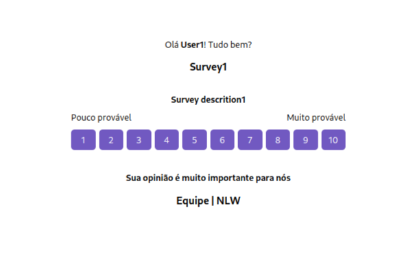
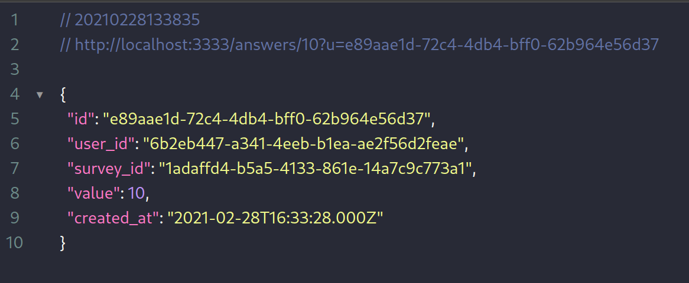
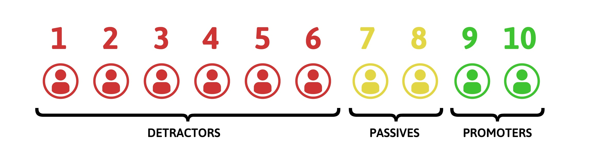

<p align="center">
  

  
</p>

---

<p align="center">
  <a href="#-technologies">Technologies</a>&nbsp;&nbsp;&nbsp;|&nbsp;&nbsp;&nbsp;
  <a href="#-project">Project</a>&nbsp;&nbsp;&nbsp;|&nbsp;&nbsp;&nbsp;
  <a href="#memo-license">License</a>
</p>

<br>


| [<br><sub>Email Template</sub>](.github/emailTemplate.png) | [<br><sub>Api Response</sub>](.github/apiResponse.png)
| :---: | :---: |

## 🚀 Technologies

This project was developed with the following technologies:

- [NodeJS](https://nodejs.org)
- [TypeScript](https://www.typescriptlang.org)
- [TypeORM](https://typeorm.io)

## :wrench: Libs

This project uses these libs:

- Yup: Validation fields
- Jest: Test
- Nodemailer: Send mail
- Handlebars: Create mail template

## 💻 Project

The NPS serves to assess customer satisfaction and loyalty to a company, regardless of its size. In general, this methodology examines how much a customer would recommend a company, its products and/or services to its friends, family and acquaintances.

<p align="center">
  
</p>

## Getting Started

First, install all dependencies and run the development server:

```bash
npm install
npm run dev
# or
yarn install
yarn dev
```

Now configure your environment variables in .env-example file and rename this file to .env:
> Example settings

```bash
# NODE PORT
NODE_PORT=3333

# BASE URL
BASE_URL=http://localhost:3333

```

After, create run all migrations:

```bash
npm run typeorm:run
# or
yarn typeorm:run
```

## :memo: License

This project is under the MIT license. See the file [LICENSE](LICENSE) for more details.
